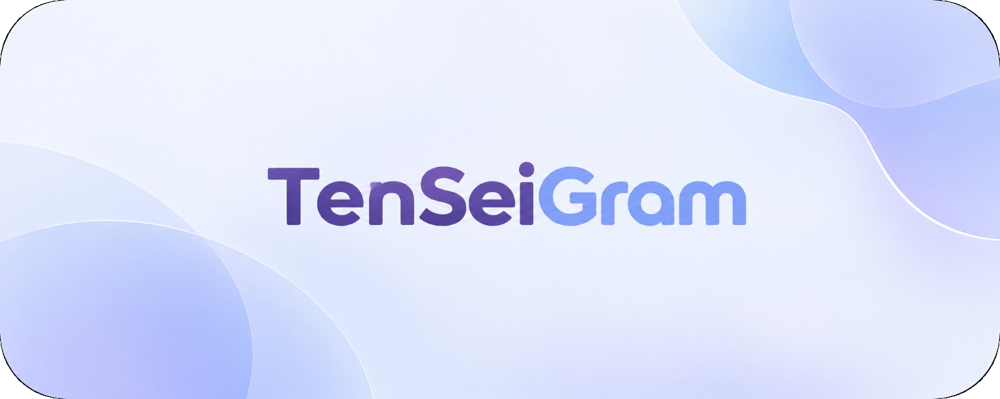
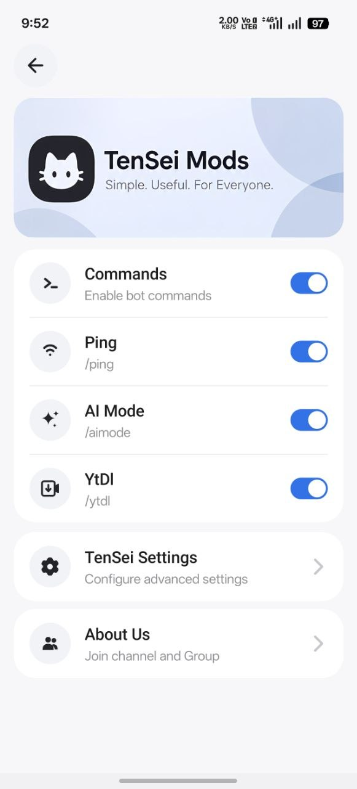
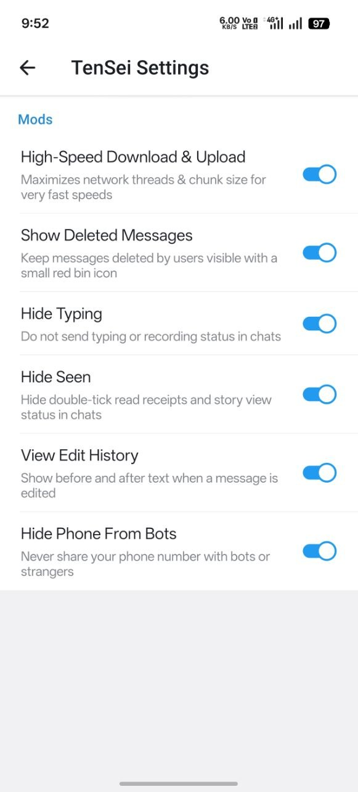
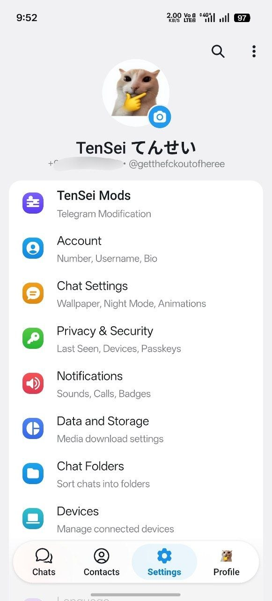
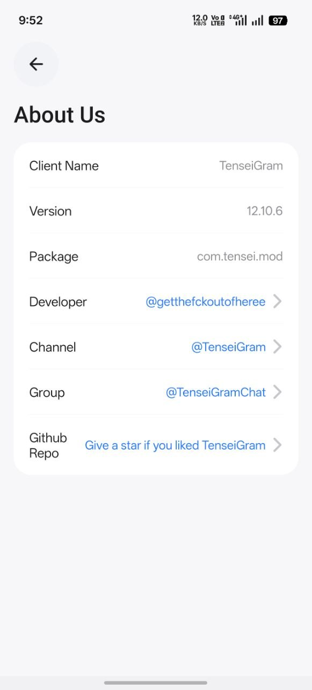

 
**Customized Telegram client for Android - privacy, performance and control.**
 

 

 

 

 

  <a href="#overview">Overview</a> - <a href="#key-features">Features</a> - <a href="#standard-telegram-vs-tenseigram">Standard vs TenSeiGram</a> - <a href="#tensei-mods">TenSei Mods</a> - <a href="#commands">Commands</a> - <a href="#ai-mode">AI Mode</a> - <a href="#media-downloader">Media Downloader</a> - <a href="#screenshots">Screenshots</a> - <a href="#developer">Developer</a> - <a href="#privacy--security">Privacy &amp; Security</a> - <a href="#get-tenseigram">Download</a> - <a href="#suggestions--support">Suggestions</a> - <a href="#community">Community</a>

---
## Overview
**TenSeiGram** is an independent build of the Telegram Android client, extended with custom modifications, privacy controls, transfer optimizations and practical everyday tools.
Everything the standard client already does is preserved. What is added lives in a separate section called **TenSei Mods**, where each modification is an individual toggle — nothing is forced, and nothing replaces an existing Telegram setting.
| | |
| :--- | :--- |
| <svg xmlns="http://www.w3.org/2000/svg" width="18" height="18" viewBox="0 0 24 24" fill="none" stroke="#2AABEE" stroke-width="2" stroke-linecap="round" stroke-linejoin="round"><rect x="3" y="3" width="18" height="18" rx="4"/><path d="M8 12h8M12 8v8"/></svg> | Original Telegram interface, fully intact |
| <svg xmlns="http://www.w3.org/2000/svg" width="18" height="18" viewBox="0 0 24 24" fill="none" stroke="#6C5CE7" stroke-width="2" stroke-linecap="round" stroke-linejoin="round"><path d="M12 3 4 7v6c0 4.4 3.4 7.4 8 8 4.6-.6 8-3.6 8-8V7z"/></svg> | Modifications isolated inside TenSei Mods |
| <svg xmlns="http://www.w3.org/2000/svg" width="18" height="18" viewBox="0 0 24 24" fill="none" stroke="#0F766E" stroke-width="2" stroke-linecap="round" stroke-linejoin="round"><circle cx="12" cy="12" r="9"/><path d="M12 7v5l3.5 2"/></svg> | Every option applies instantly, no restart |
> TenSeiGram is not affiliated with, endorsed by or connected to Telegram FZ-LLC. See the [Disclaimer](#disclaimer).
---
## Key Features

|  | Feature | Description |
| :--- | :--- | :--- |
| <svg xmlns="http://www.w3.org/2000/svg" width="18" height="18" viewBox="0 0 24 24" fill="none" stroke="#6C5CE7" stroke-width="2" stroke-linecap="round"><path d="M4 6h10M18 6h2M4 12h4M12 12h8M4 18h10M18 18h2"/><circle cx="16" cy="6" r="2"/><circle cx="10" cy="12" r="2"/><circle cx="16" cy="18" r="2"/></svg> | **TenSei Mods** | A dedicated section housing every TenSeiGram modification and control. |
| <svg xmlns="http://www.w3.org/2000/svg" width="18" height="18" viewBox="0 0 24 24" fill="none" stroke="#E91E63" stroke-width="2" stroke-linecap="round" stroke-linejoin="round"><path d="M21 12a8 8 0 0 1-8 8H4l2.5-3A8 8 0 1 1 21 12z"/><circle cx="12" cy="12" r="2.5"/></svg> | **Hide Typing** | Prevents typing and recording indicators from being sent in chats. |
| <svg xmlns="http://www.w3.org/2000/svg" width="18" height="18" viewBox="0 0 24 24" fill="none" stroke="#9C27B0" stroke-width="2" stroke-linecap="round" stroke-linejoin="round"><path d="M1.5 12S5 5.5 12 5.5 22.5 12 22.5 12 19 18.5 12 18.5 1.5 12 1.5 12z"/><circle cx="12" cy="12" r="3"/></svg> | **Hide Seen** | Withholds read receipts and story-view status from other users. |
| <svg xmlns="http://www.w3.org/2000/svg" width="18" height="18" viewBox="0 0 24 24" fill="none" stroke="#C0392B" stroke-width="2" stroke-linecap="round" stroke-linejoin="round"><path d="M4 6h16M9 6V4h6v2M6 6l1 14h10l1-14M10 10v6M14 10v6"/></svg> | **Show Deleted Messages** | Retains deleted messages in place with a clear deleted-message indicator. |
| <svg xmlns="http://www.w3.org/2000/svg" width="18" height="18" viewBox="0 0 24 24" fill="none" stroke="#2980B9" stroke-width="2" stroke-linecap="round" stroke-linejoin="round"><circle cx="12" cy="12" r="9"/><path d="M12 7v5l3.5 2"/></svg> | **View Edit History** | Displays the previous and updated versions of edited messages. |
| <svg xmlns="http://www.w3.org/2000/svg" width="18" height="18" viewBox="0 0 24 24" fill="none" stroke="#F39C12" stroke-width="2" stroke-linecap="round" stroke-linejoin="round"><path d="M23 19a2 2 0 0 1-2 2H3a2 2 0 0 1-2-2V8a2 2 0 0 1 2-2h4l2-3h6l2 3h4a2 2 0 0 1 2 2z"/><circle cx="12" cy="13" r="4"/></svg> | **Enable Screenshot**[span_0](start_span)[span_0](end_span) | Take screenshots anywhere, even in restricted chats.[span_1](start_span)[span_1](end_span) |
| <svg xmlns="http://www.w3.org/2000/svg" width="18" height="18" viewBox="0 0 24 24" fill="none" stroke="#3498DB" stroke-width="2" stroke-linecap="round" stroke-linejoin="round"><polyline points="15 14 20 9 15 4"/><path d="M4 20v-7a4 4 0 0 1 4-4h12"/></svg> | **Enable Forward**[span_2](start_span)[span_2](end_span) | Forward anything from any group, channel or bot.[span_3](start_span)[span_3](end_span) |
| <svg xmlns="http://www.w3.org/2000/svg" width="18" height="18" viewBox="0 0 24 24" fill="none" stroke="#8E44AD" stroke-width="2" stroke-linecap="round" stroke-linejoin="round"><rect x="4" y="10" width="16" height="10" rx="2"/><path d="M8 10V7a4 4 0 0 1 8 0v3"/></svg> | **Hide Phone From Bots** | Helps prevent your phone number from being shared with bots where applicable. |
| <svg xmlns="http://www.w3.org/2000/svg" width="18" height="18" viewBox="0 0 24 24" fill="none" stroke="#16A085" stroke-width="2" stroke-linecap="round" stroke-linejoin="round"><path d="M13 2 4 14h7l-1 8 9-12h-7z"/></svg> | **High-Speed Transfer** | Tuned networking threads and chunk sizes for faster downloads and uploads. |
| <svg xmlns="http://www.w3.org/2000/svg" width="18" height="18" viewBox="0 0 24 24" fill="none" stroke="#0F766E" stroke-width="2" stroke-linecap="round" stroke-linejoin="round"><rect x="7" y="7" width="10" height="10" rx="2"/><rect x="10" y="10" width="4" height="4"/><path d="M10 3v4M14 3v4M10 17v4M14 17v4M3 10h4M3 14h4M17 10h4M17 14h4"/></svg> | **AI Mode** | Answers requests through 10 AI models with automatic fallback on failure. |
| <svg xmlns="http://www.w3.org/2000/svg" width="18" height="18" viewBox="0 0 24 24" fill="none" stroke="#D35400" stroke-width="2" stroke-linecap="round" stroke-linejoin="round"><path d="M12 3v11M7.5 10 12 14.5 16.5 10M4 20h16"/></svg> | **Media Downloader** | Saves YouTube, Instagram and TikTok videos locally and re-uploads them via Telegram. |
| <svg xmlns="http://www.w3.org/2000/svg" width="18" height="18" viewBox="0 0 24 24" fill="none" stroke="#7F8C8D" stroke-width="2" stroke-linecap="round" stroke-linejoin="round"><rect x="3" y="4" width="18" height="16" rx="3"/><path d="m7 9 3 3-3 3M13 15h4"/></svg> | **Command Manager** | Enables or disables each supported command individually. |

---
## Standard Telegram vs TenSeiGram

| Capability | Standard Telegram | TenSeiGram |
| :--- | :--- | :--- |
| Chats, media, calls, stickers | ✓ | ✓ |
| Official MTProto API | ✓ | ✓ |
| Account, privacy and notification settings | ✓ | ✓ |
| **Hide Typing** | — | ✓ |
| **Hide Seen** | — | ✓ |
| **Show Deleted Messages** | — | ✓ |
| **View Edit History** | — | ✓ |
| **Enable Screenshot**[span_4](start_span)[span_4](end_span) | — | ✓ |
| **Enable Forward**[span_5](start_span)[span_5](end_span) | — | ✓ |
| **Hide Phone From Bots** | — | ✓ |
| **High-Speed Download & Upload** | — | ✓ |
| **AI Mode (10 models, fallback)** | — | ✓ |
| **Media Downloader (YouTube / Instagram / TikTok)** | — | ✓ |
| **Command Manager** | — | ✓ |

TenSeiGram is not a fork published by Telegram or any third party. It is an independent client built on top of the official Telegram API and MTProto.
---
## TenSei Mods
**TenSei Mods** is a dedicated section that groups every custom modification in one place, kept separate from the standard Telegram settings. Each modification is a single toggle and applies immediately.

|  | Modification | Result |
| :--- | :--- | :--- |
| <svg xmlns="http://www.w3.org/2000/svg" width="18" height="18" viewBox="0 0 24 24" fill="none" stroke="#16A085" stroke-width="2" stroke-linecap="round" stroke-linejoin="round"><path d="M13 2 4 14h7l-1 8 9-12h-7z"/></svg> | **High-Speed Download & Upload** | Increased transfer throughput through tuned networking threads. |
| <svg xmlns="http://www.w3.org/2000/svg" width="18" height="18" viewBox="0 0 24 24" fill="none" stroke="#C0392B" stroke-width="2" stroke-linecap="round" stroke-linejoin="round"><path d="M4 6h16M9 6V4h6v2M6 6l1 14h10l1-14M10 10v6M14 10v6"/></svg> | **Show Deleted Messages** | Removed messages stay visible with a deleted-message indicator. |
| <svg xmlns="http://www.w3.org/2000/svg" width="18" height="18" viewBox="0 0 24 24" fill="none" stroke="#E91E63" stroke-width="2" stroke-linecap="round" stroke-linejoin="round"><path d="M21 12a8 8 0 0 1-8 8H4l2.5-3A8 8 0 1 1 21 12z"/><circle cx="12" cy="12" r="2.5"/></svg> | **Hide Typing** | Typing and recording status is no longer sent to other users. |
| <svg xmlns="http://www.w3.org/2000/svg" width="18" height="18" viewBox="0 0 24 24" fill="none" stroke="#9C27B0" stroke-width="2" stroke-linecap="round" stroke-linejoin="round"><path d="M1.5 12S5 5.5 12 5.5 22.5 12 22.5 12 19 18.5 12 18.5 1.5 12 1.5 12z"/><circle cx="12" cy="12" r="3"/></svg> | **Hide Seen** | Read receipts and story views are withheld. |
| <svg xmlns="http://www.w3.org/2000/svg" width="18" height="18" viewBox="0 0 24 24" fill="none" stroke="#2980B9" stroke-width="2" stroke-linecap="round" stroke-linejoin="round"><circle cx="12" cy="12" r="9"/><path d="M12 7v5l3.5 2"/></svg> | **View Edit History** | The complete edit history of a message is viewable. |
| <svg xmlns="http://www.w3.org/2000/svg" width="18" height="18" viewBox="0 0 24 24" fill="none" stroke="#F39C12" stroke-width="2" stroke-linecap="round" stroke-linejoin="round"><path d="M23 19a2 2 0 0 1-2 2H3a2 2 0 0 1-2-2V8a2 2 0 0 1 2-2h4l2-3h6l2 3h4a2 2 0 0 1 2 2z"/><circle cx="12" cy="13" r="4"/></svg> | **Enable Screenshot**[span_6](start_span)[span_6](end_span) | Take screenshots anywhere, even in restricted chats.[span_7](start_span)[span_7](end_span) |
| <svg xmlns="http://www.w3.org/2000/svg" width="18" height="18" viewBox="0 0 24 24" fill="none" stroke="#3498DB" stroke-width="2" stroke-linecap="round" stroke-linejoin="round"><polyline points="15 14 20 9 15 4"/><path d="M4 20v-7a4 4 0 0 1 4-4h12"/></svg> | **Enable Forward**[span_8](start_span)[span_8](end_span) | Forward anything from any group, channel or bot.[span_9](start_span)[span_9](end_span) |
| <svg xmlns="http://www.w3.org/2000/svg" width="18" height="18" viewBox="0 0 24 24" fill="none" stroke="#8E44AD" stroke-width="2" stroke-linecap="round" stroke-linejoin="round"><rect x="4" y="10" width="16" height="10" rx="2"/><path d="M8 10V7a4 4 0 0 1 8 0v3"/></svg> | **Hide Phone From Bots** | Phone-number exposure to bots is limited where applicable. |

---
## Commands

|  | Command | Function |
| :--- | :--- | :--- |
| <svg xmlns="http://www.w3.org/2000/svg" width="18" height="18" viewBox="0 0 24 24" fill="none" stroke="#2C3E50" stroke-width="2" stroke-linecap="round" stroke-linejoin="round"><path d="M2 12h4l3-8 4 16 3-8h6"/></svg> | `/ping` | Checks response time and connectivity. |
| <svg xmlns="http://www.w3.org/2000/svg" width="18" height="18" viewBox="0 0 24 24" fill="none" stroke="#0F766E" stroke-width="2" stroke-linecap="round" stroke-linejoin="round"><rect x="7" y="7" width="10" height="10" rx="2"/><rect x="10" y="10" width="4" height="4"/><path d="M10 3v4M14 3v4M10 17v4M14 17v4M3 10h4M3 14h4M17 10h4M17 14h4"/></svg> | `/aimode` | Activates AI Mode, powered by 10 AI models. |
| <svg xmlns="http://www.w3.org/2000/svg" width="18" height="18" viewBox="0 0 24 24" fill="none" stroke="#D35400" stroke-width="2" stroke-linecap="round" stroke-linejoin="round"><path d="M12 3v11M7.5 10 12 14.5 16.5 10M4 20h16"/></svg> | `/ytdl` | Downloads supported YouTube, Instagram and TikTok videos and re-uploads them through Telegram. |

All commands can be enabled, disabled or reviewed from **TenSei Mods → Commands**.
---
## AI Mode
AI Mode answers requests using **10 different AI models** instead of a single provider.
Rather than depending on one model, TenSeiGram uses a fallback system: if a model fails, becomes unavailable or cannot produce a response, the request is passed automatically to another available model. This keeps the feature responsive under varying network and server conditions instead of returning an error to the user.
---
## Media Downloader
The Media Downloader accepts **YouTube**, **Instagram** and **TikTok** video links.

  
  
  

When a supported link is submitted, the video is **downloaded to local storage first** and then **uploaded directly through Telegram**. Handling the transfer in two stages keeps the process stable, avoids re-encoding issues and allows the result to be forwarded or shared immediately without leaving the chat.
Supported input is limited to YouTube, Instagram and TikTok video links.
---
## Get TenSeiGram

  
  

  <a href="https://github.com/Koustubh12345/TenSeiGram/releases/latest">Open the releases page</a> - <a href="https://t.me/TenseiGram">Latest updates on Telegram</a>

Builds are published on the GitHub releases page. Open the download button to get the most recent stable APK, along with its changelog and previous versions.
---
## Suggestions & Support
Feature requests are welcome and are the main way TenSeiGram grows.

|  | Where | What for |
| :--- | :--- | :--- |
| <svg xmlns="http://www.w3.org/2000/svg" width="18" height="18" viewBox="0 0 24 24" fill="none" stroke="#2AABEE" stroke-width="2" stroke-linecap="round" stroke-linejoin="round"><path d="M21 15a2 2 0 0 1-2 2H7l-4 4V5a2 2 0 0 1 2-2h14a2 2 0 0 1 2 2z"/></svg> | [@TenseiGramChat](https://t.me/TenseiGramChat) | Join the community group to **suggest new features**, report issues and discuss ideas. |
| <svg xmlns="http://www.w3.org/2000/svg" width="18" height="18" viewBox="0 0 24 24" fill="none" stroke="#2AABEE" stroke-width="2" stroke-linecap="round" stroke-linejoin="round"><path d="M3 11v3a1 1 0 0 0 1 1h3l5 4V6L7 10H4a1 1 0 0 0-1 1z"/><path d="M16 8a5 5 0 0 1 0 8M19 5a9 9 0 0 1 0 14"/></svg> | [@TenseiGram](https://t.me/TenseiGram) | Follow the channel for the **latest updates**, release announcements and status posts. |

If you have an idea for a new modification, a command or an improvement, post it in the community group — suggestions are reviewed and the accepted ones are added to a future build.
---
## Screenshots

### TenSei Mods

### TenSei Settings

### Telegram Settings

### About TenSeiGram

---
## Project Information

| Property | Details |
| :--- | :--- |
| **Client** | TenSeiGram |
| **Package** | `com.tensei.mod` |
| **Platform** | Android |
| **Type** | Third-party Telegram client |
| **Source Code** | Private |
| **Protocol** | MTProto |

---
## Source Code
TenSeiGram is **not open source** and all rights are reserved.
The client source code, proprietary modifications and internal implementation are not publicly distributed or reproduced. This repository exists for project information, feature documentation, screenshots and official community links only.
---
## Developer
TenSeiGram is developed and maintained independently by a single developer.

|  | Platform | Account | Handle |
| :--- | :--- | :--- | :--- |
| <svg xmlns="http://www.w3.org/2000/svg" width="18" height="18" viewBox="0 0 24 24" fill="none" stroke="#2AABEE" stroke-width="2" stroke-linecap="round" stroke-linejoin="round"><path d="M21.9 4.3 16.7 19.6c-.3.9-1.4 1.1-2 .4l-4.4-4.6-2.7 2.6c-.3.3-.7.4-1.1.4l.6-4.9L17.5 3.4c.5-.5 1.2 0 1 .9l3.4-.1z"/></svg> | Telegram | [@getthefckoutofheree](https://t.me/getthefckoutofheree) | `@getthefckoutofheree` |
| <svg xmlns="http://www.w3.org/2000/svg" width="18" height="18" viewBox="0 0 24 24" fill="none" stroke="#181717" stroke-width="2" stroke-linecap="round" stroke-linejoin="round"><path d="M9 19c-4 1.4-4-2.2-5.6-2.7M15 21v-3.4c0-1 .1-1.4-.5-2 2.8-.3 5.5-1.4 5.5-6a4.6 4.6 0 0 0-1.3-3.2 4.3 4.3 0 0 0-.1-3.2s-1-.3-3.4 1.3a11.6 11.6 0 0 0-6 0C6.7 2.9 5.7 3.2 5.7 3.2a4.3 4.3 0 0 0-.1 3.2A4.6 4.6 0 0 0 4.3 9.6c0 4.6 2.7 5.7 5.5 6-.5.5-.6 1.1-.6 1.9V21"/></svg> | GitHub | [Koustubh12345](https://github.com/Koustubh12345) | `@Koustubh12345` |

  
  

---
## Community

| Channel | Purpose | Link |
| :--- | :--- | :--- |
| **Updates** | Releases, announcements and status posts. | [@TenseiGram](https://t.me/TenseiGram) |
| **Community** | Discussion, feedback and support. | [@TenseiGramChat](https://t.me/TenseiGramChat) |

---
## Privacy & Security
TenSeiGram is built to be safe to use. The following is what the design guarantees, and how each point can be verified.

|  | Commitment | How it is met |
| :--- | :--- | :--- |
| <svg xmlns="http://www.w3.org/2000/svg" width="18" height="18" viewBox="0 0 24 24" fill="none" stroke="#0F766E" stroke-width="2" stroke-linecap="round" stroke-linejoin="round"><path d="M12 3 4 7v6c0 4.4 3.4 7.4 8 8 4.6-.6 8-3.6 8-8V7z"/><path d="m9 12 2 2 4-4"/></svg> | No third-party data collection | No analytics, advertising or tracking SDKs are bundled in the client. |
| <svg xmlns="http://www.w3.org/2000/svg" width="18" height="18" viewBox="0 0 24 24" fill="none" stroke="#0F766E" stroke-width="2" stroke-linecap="round" stroke-linejoin="round"><rect x="4" y="10" width="16" height="10" rx="2"/><path d="M8 10V7a4 4 0 0 1 8 0v3"/></svg> | No data sold or shared | Nothing is sold, shared or transferred to third parties. |
| <svg xmlns="http://www.w3.org/2000/svg" width="18" height="18" viewBox="0 0 24 24" fill="none" stroke="#0F766E" stroke-width="2" stroke-linecap="round" stroke-linejoin="round"><circle cx="12" cy="12" r="9"/><path d="M3 12h18M12 3a15 15 0 0 1 0 18 15 15 0 0 1 0-18"/></svg> | Direct MTProto only | Communication uses the official Telegram API. No proxy or relay server sits in the middle. |
| <svg xmlns="http://www.w3.org/2000/svg" width="18" height="18" viewBox="0 0 24 24" fill="none" stroke="#0F766E" stroke-width="2" stroke-linecap="round" stroke-linejoin="round"><rect x="4" y="3" width="16" height="18" rx="2"/><path d="M8 7h8M8 11h8M8 15h5"/></svg> | Least-privilege permissions | Only permissions required for the selected features are requested. |
| <svg xmlns="http://www.w3.org/2000/svg" width="18" height="18" viewBox="0 0 24 24" fill="none" stroke="#0F766E" stroke-width="2" stroke-linecap="round" stroke-linejoin="round"><path d="M12 3v12M7.5 10 12 14.5 16.5 10M4 20h16"/></svg> | Downloads stay on device | Media downloaded with `/ytdl` is stored locally and uploaded directly to Telegram. |
| <svg xmlns="http://www.w3.org/2000/svg" width="18" height="18" viewBox="0 0 24 24" fill="none" stroke="#0F766E" stroke-width="2" stroke-linecap="round" stroke-linejoin="round"><circle cx="12" cy="12" r="9"/><path d="M12 8v4M12 16h.01"/></svg> | Transparency | Verification is possible by inspecting the app's network activity and requested permissions. |

These points describe how the client is built. As with any closed-source application, independent verification requires an audit, and none has been published.
---
## Telegram API
TenSeiGram operates using the official Telegram APIs over the **MTProto** protocol. Refer to the official [MTProto documentation](https://core.telegram.org/api) for protocol-level information.
---
## Disclaimer
TenSeiGram is an independent third-party Telegram client.
TenSeiGram is not affiliated with, endorsed by, sponsored by or officially connected to Telegram or Telegram FZ-LLC. Telegram and all related trademarks belong to their respective owners.
Users are responsible for complying with Telegram's Terms of Service and all applicable laws.
---

